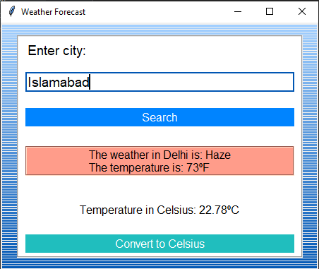

# Weather Forecast Application

This is a simple Python application built using the Tkinter library for providing weather forecasts based on user input. It fetches weather data from the OpenWeatherMap API and displays it in both Fahrenheit and Celsius. Additionally, it changes the background color based on the temperature.

## Features

- **Weather Data**: Fetches weather information (temperature and weather condition) for a specified city from the OpenWeatherMap API.
- **Temperature Conversion**: Converts the fetched temperature from Fahrenheit to Celsius upon user request.
- **Dynamic Background**: Changes the background color dynamically based on the temperature.

## Usage

To run this application, you need to have Python 3.x installed along with the Tkinter and requests libraries.

### Installation

You need to install the following dependencies:

- Tkinter library: This is usually included with Python installations.
- requests library: You can install it using pip:

    ```bash
    pip install requests
    ```

### Obtaining API Key

Before running the application, you need to obtain an API key from OpenWeatherMap. Follow these steps to get your API key:

1. Visit the [OpenWeatherMap website](https://openweathermap.org/) and sign up for a free account.
2. After signing up and logging in, go to your account dashboard.
3. Navigate to the API keys section.
4. Generate a new API key.
5. Copy the generated API key.

### Running the Application

1. Open the file in a text editor and paste your API key:

    ```python
    api_key = 'YOUR_API_KEY_HERE'
    ```

2. Save the file and close the text editor.

3. Run the application:

4. Enter the name of the city for which you want to check the weather forecast.
   
5. Click on the "Search" button to fetch the weather information.
   
6. Optionally, you can click on the "Convert to Celsius" button to view the temperature in Celsius.

## Screenshots



## Credits

This application was created by Muhammad Hamza.
